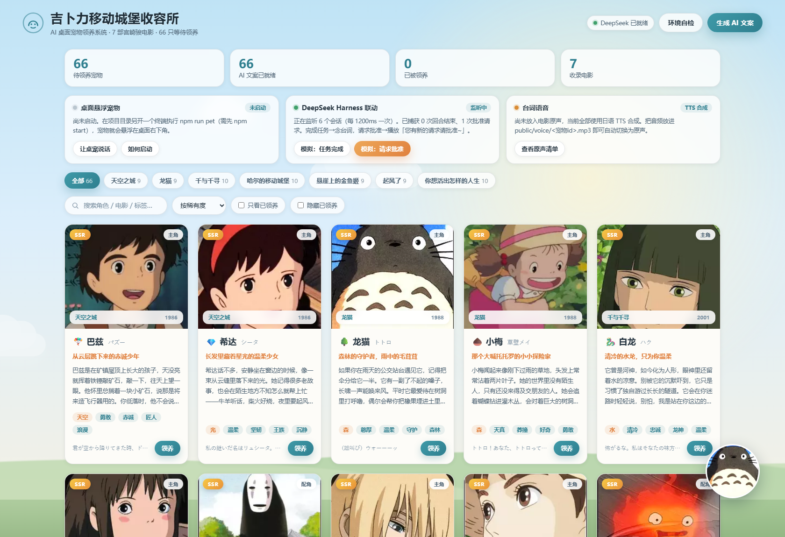
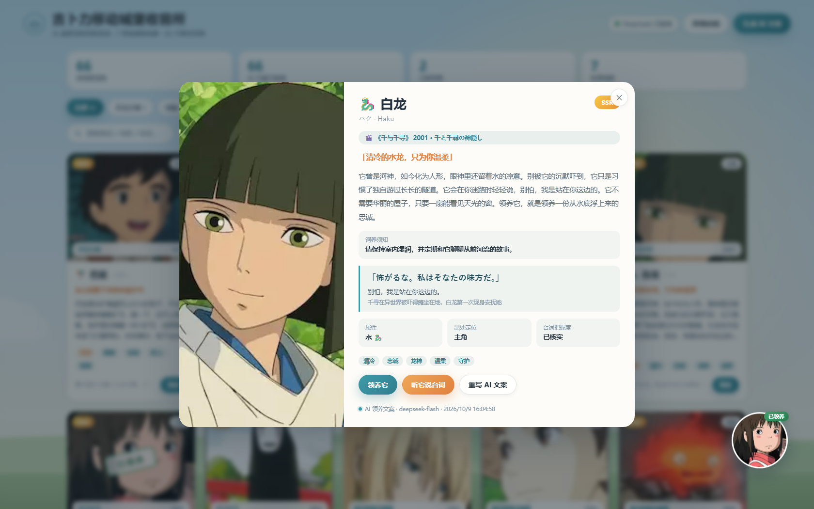

# 吉卜力移动城堡收容所 · AI 桌面宠物领养系统

一个可运行的 **AI 桌面宠物领养系统**：网页右下角住着一只可以拖动的小宠物，主界面陈列 **66 只来自 7 部宫崎骏电影的角色**，每只都由 **DeepSeek 大模型**撰写了专属领养文案。点击「领养」，它会用**日语说出自己的经典台词**。

此外它还是一个**真正悬浮在桌面上的宠物**：一个置顶的透明窗口，压在所有窗口（包括浏览器全屏）之上，可拖动、会说话；并且与 **DeepSeek Harness 联动**——DSH 完成任务时念出角色台词，DSH 请求你批准时用少女音提醒你「您有新的请求请批准~」。

> 后端从本机环境 / 凭据文件中读取 DeepSeek API Key，无需把密钥写进代码。

> **关于这个项目**：这是我第一次用 **DeepSeek Harness（DSH）** 做完整项目的尝试。
> 项目从零到交付（抓图 → 建目录 → 写前后端 → 调 DSH 内部事件 → 调试桌面悬浮窗）
> 全部在 DSH 会话里完成，没有手写一行代码。过程中沉淀的两份调研报告
> （[DSH 事件集成调研](docs/research/DSH事件集成调研报告.md)、
> [电影原声可行性调研](docs/research/电影原声可行性调研报告.md)）
> 也一并留在仓库里，里面记录了哪些路走通了、哪些走不通、以及为什么。

---

## 目录

- [效果预览](#效果预览)
- [功能特性](#功能特性)
- [快速开始](#快速开始)
- [使用说明：它是怎么活的、怎么关、怎么召唤回来](#使用说明它是怎么活的怎么关怎么召唤回来)
- [桌面悬浮宠物](#桌面悬浮宠物)
- [DeepSeek Harness 联动](#deepseek-harness-联动)
- [台词语音：电影原声 vs TTS](#台词语音电影原声-vs-tts)
- [两种运行方式](#两种运行方式)
- [DeepSeek API Key 从哪里读](#deepseek-api-key-从哪里读)
- [目录结构](#目录结构)
- [HTTP API](#http-api)
- [宠物数据与图片](#宠物数据与图片)
- [自测](#自测)
- [常见问题](#常见问题)
- [版权说明](#版权说明)

---

## 效果预览

| 首页 · 领养所（含悬浮层 / DSH / 语音联动面板） |
| --- |
|  |

| 宠物详情 · AI 文案 | 经典日语台词 |
| --- | --- |
|  |  |

| 桌面悬浮窗口的渲染内容（气泡 + 宠物，背景完全透明） |
| --- |
|  |

---

## 功能特性

### 🐾 右下角桌面宠物挂件
- 默认出现在**视口右下角**，可**自由拖动**到屏幕任意位置（鼠标 / 触摸 / 触控笔均可）
- 拖动与点击自动区分：位移小于 5px 视为点击，点击即打开该宠物的详情
- 位置写入 `localStorage`，刷新后仍在原处；窗口缩放时自动收回视口内
- 拖到屏幕左半边时，台词气泡会自动改从左侧展开
- 挂件工具栏：`领养所` / `说话` / `归位`
- 宠物有呼吸浮动动画，说话时会点头

### 🤖 AI 领养文案
- 后端调用 **DeepSeek** 为**每一只**宠物生成：一句话标语 / 90–140 字领养文案 / 性格标签 / 饲养须知
- **批量请求**（每批 5 只）+ **结果缓存**（`server/data/generated/copy.json`），已生成的不重复调用
- 首次启动自动补齐缺失文案；右上角按钮可随时重新生成；详情页支持单只「重写 AI 文案」
- 生成进度实时轮询展示
- **没有 API Key 也能跑**：自动降级为内置模板文案，界面功能完全正常

### 🎬 领养即念台词
- 每只宠物都配有考证过的**经典日语台词**、中文翻译与出处场景
- 领养成功后弹出台词卡，并用浏览器 **Web Speech API（ja-JP）** 朗读
- 台词card 与挂件气泡同步显示；挂件「说话」按钮可随时再听一次
- 台词库标注可信度：`已核实` / `较可信` / `无台词`，**不确定的条目宁可留空也不编造**

### 🖼 宠物图鉴
- 66 只角色，覆盖 **天空之城 / 龙猫 / 千与千寻 / 哈尔的移动城堡 / 悬崖上的金鱼姬 / 起风了 / 你想活出怎样的人生**
- 按电影筛选、关键词搜索、按稀有度 / 年份 / 名字排序
- 稀有度 SSR / SR / R / N + 属性 + 性格标签
- 「只看已领养」「隐藏已领养」筛选

### 🧱 零运行时依赖
- 后端、前端、抓取工具**全部只使用 Node.js 标准库**，**不需要 `npm install`**
- 桌面悬浮层用 Windows 自带的 .NET Framework 编译器（`csc.exe`）现场编译，**同样不需要装任何东西**
- 克隆下来 `npm start` 直接跑

---

## 桌面悬浮宠物

`desktop/PetOverlay.exe` 是一个**真正的桌面悬浮窗**，不是网页里的浮层：

| 特性 | 实现 |
| --- | --- |
| 压在所有窗口之上（含浏览器全屏） | `Topmost=true` + `WS_EX_TOPMOST`；已用 `WindowFromPoint` 验证 |
| 背景完全透明，只看得见宠物和气泡 | `AllowsTransparency=true` + `WS_EX_LAYERED` 分层窗口 |
| 可拖动 | 按住宠物拖动（WPF `DragMove`）；右键菜单可「归位」 |
| **空白区域鼠标穿透** | 窗口为了容纳气泡而比宠物大，空白处通过 `WM_NCHITTEST → HTTRANSPARENT` 让点击落到下层窗口 |
| 呼吸浮动 + 说话点头 | WPF 动画 |
| 播放语音 | MCI（`winmm`），**不依赖 Windows Media Player** |

### 启动

```bash
# 终端 A —— 后端（含 DSH 监听）
npm start

# 终端 B —— 编译并启动悬浮宠物
npm run pet
```

或者直接双击 `desktop\start.cmd`。

> 悬浮层是独立进程，通过轮询 `GET /api/overlay/poll?since=<游标>` 从后端取指令
> （换宠物 / 念台词 / 弹气泡 / 退出），后端没起来它会静默重试，不会打扰你。

### 命令行参数

```bash
desktop\PetOverlay.exe --api http://127.0.0.1:8787   # 后端地址
                       --pet totoro-totoro           # 指定初始宠物
                       --x 1200 --y 700              # 指定初始位置
                       --no-topmost                  # 不置顶（调试用）
```

运行日志写在 `desktop\PetOverlay.log`（winexe 没有控制台，出错看这里）。

### 为什么不用 Electron

本机 `npm install` 会被沙箱拒绝，且 Electron 需要下载上百 MB。而 Windows 自带的
.NET Framework + `csc.exe` 就能编译出一个真·透明置顶窗口，零下载、零依赖、启动更快。

---

## DeepSeek Harness 联动

DshWatcher 监听 DSH 的会话日志（`~/.dsh/sessions/**/session.v4.jsonl.zstd`），感知两类事件：

| DSH 事件 | 日志判据 | 宠物动作 |
| --- | --- | --- |
| **任务完成** | `turn/end` 且 `data.reason.kind === 'completed'` | 念出当前陪伴角色的**经典日语台词** |
| **请求批准** | 出现 `approval/asked` 且尚无配对的 `approval/decided` | 用少女音播放 **「您有新的请求请批准~」** |

### 为什么是轮询会话日志

调研结论（`_dsh_probe/DSH-事件集成调研报告.md`）：DSH **有** Cordis 插件系统与 ACP 协议，但
**没有**出站通知 / webhook / 可挂命令的配置文件；而 Claude Code hooks 桥明确不支持
`PermissionRequest`，感知不到审批。会话日志是唯一零改造就能用的途径，且读取方无需任何锁。

日志是 **zstd 多帧追加**的 JSONL，`zlib.zstdDecompressSync` 对整文件只会解出第一帧，
所以 `server/lib/zstd-frames.js` 按帧魔术字逐帧切分（并容忍正在写入的末帧）。
实测「已请求但未决策」的状态会**作为独立帧立即落盘**，最长窗口达 252 秒，轮询完全来得及。

### 配置

| 环境变量 | 默认 | 说明 |
| --- | --- | --- |
| `DSH_WATCH` | `1` | 设为 `0` 关闭监听 |
| `DSH_WATCH_SUBAGENTS` | `0` | 设为 `1` 连子代理的事件也播报（默认静音，否则太吵） |
| `DSH_WATCH_INTERVAL_MS` | `1200` | 轮询间隔 |

状态查询：`GET /api/dsh/status`、`GET /api/dsh/pending`。
网页上的「DeepSeek Harness 联动」面板也会实时显示监听状态与待批准数量，
并有两个**模拟按钮**方便你不跑真实任务也能试听效果。

---

## 台词语音：电影原声 vs TTS

程序**优先播放电影原声**，找不到就用日语 TTS 合成。切换方式是纯文件级的，不需要改代码：

```
public/voice/<宠物id>.mp3     ← 放进去 = 用原声
（不存在）                     ← 自动回退到日语 TTS
```

支持 `.mp3 .wav .m4a .ogg .opus .flac .aac`。
`GET /api/voice/line/<宠物id>?source=tts` 可以强制走 TTS，方便与原声对比试听。

### ⚠️ 关于「自动抓取电影原声」——做不到，如实说明

我实测了 20 多个候选站点与 4 类数据集，**没有任何可达来源能直接提供吉卜力单句台词的原声音频**：

- **B 站**：`playurl` 免登录可用（实测能按 Range 拿到音频流），但**搜不到包含这些台词的内容**，
  且搜索接口连调 2~3 次即被 `-412` 封禁；正片对白与 BGM 混录，切出来并不干净
- **语音素材站**：`anime-voice.com` / `koe-voice.com` 已是域名停放页或无关站点，`voice-quality.com` 已下线
- **数据集**：`joujiboi/japanese-anime-speech-v2`（292,637 条）逐行核对后确认**全部来自 galgame，无一条吉卜力**
- **GitHub / HuggingFace / Freesound / archive.org / YouTube**：无可达资源或全部超时
- 本机也没有 `ffmpeg` / `yt-dlp` / `python`，切片链路缺工具

### ✅ 替代方案：精确的截取时间戳清单

电影原声拿不到，但**官方日语字幕可以**。`kitsunekko.net` 提供 5/7 部电影的日语 SRT（含逐句时间戳），
我用它们把每句台词在片中的位置精确算了出来：

```bash
npm run voice:clips          # 下载字幕 → BOM 感知解码 → Dice 双字母模糊匹配 → 生成清单
```

结果：**25 / 40 句台词精确定位到时间戳**（比朴素的整句匹配多出 10 句，因为匹配器会**合并被切开的相邻字幕**）。

| 角色 | 电影 | 起始时间 | 时长 | 匹配度 |
| --- | --- | --- | --- | --- |
| 荻野千寻 | 千与千寻 | `00:37:36.407` | 1.43s | 1.00 |
| 白龙 | 千与千寻 | `00:14:53.447` | 2.04s | 0.96 |
| 哈尔 | 哈尔的移动城堡 | `01:34:00.320` | 5.42s | 0.98 |
| 苏菲 | 哈尔的移动城堡 | `01:14:04.397` | 3.00s | 1.00 |
| 希达 | 天空之城 | `00:51:48.339` | 6.46s | 1.00 |
| 小梅 | 龙猫 | `00:34:24.460` | 4.00s | 1.00 |
| …（共 25 条，完整清单见 `public/voice/clips.json` 与 `public/voice/README.md`） | | | | |

拿到清单后，用**你自己合法持有的片源**切片即可：

```bash
ffmpeg -ss 00:37:36.400 -t 3 -i "你的片源.mkv" -vn -acodec libmp3lame -q:a 4 \
       "public/voice/chihiro-kaonashi.mp3"
```

重启后端，`GET /api/voice/line/chihiro-kaonashi` 的 `source` 就会变成 `original`。

> 未覆盖的部分：**起风了**与**你想活出怎样的人生**在 kitsunekko 没有日语字幕，
> 共 11 句无法定位；另有 4 句在字幕中找不到足够相似的句子。这些角色继续使用 TTS。

### TTS 用的是哪种声音

**Edge TTS**（微软 Edge 浏览器「大声朗读」背后的服务），免费、无需 API Key、音质接近神经网络语音。

- **角色台词** → `ja-JP-NanamiNeural`（日语女声）
- **批准提醒** → `zh-CN-XiaoyiNeural` + 音调 `+45Hz` / 语速 `+14%` / 音量 `+10%`，
  这是现有免费中文语音里最接近「涂山苏苏」那种稚气少女感的（微软官方把它归类为 *Cartoon*）。
  预设见 `server/lib/edge-tts.js` 的 `STYLE_PRESETS`，可选 `susu` / `susuSoft` / `girl` / `gentle` / `lively`，
  也可以设 `APPROVAL_VOICE_PRESET` 环境变量切换。**我无法试听，所以做了多个预设供你挑。**

> 实现上的两个坑（都已填平，见 `server/lib/edge-tts.js` 注释）：
> ① 握手必须带 `Origin: chrome-extension://jdiccldimpdaibmpdkjnbmckianbfold` 等请求头，
> 而浏览器规范的 WebSocket 不允许自定义头，所以 `server/lib/ws.js` 自己实现了握手与帧解析；
> ② `Sec-MS-GEC` 签名里的 `ticks*1e7` 超过 `Number.MAX_SAFE_INTEGER`，**必须用 BigInt**，
> 用浮点会算出错误签名直接 403。
> 另外实测该服务**已不再支持 PCM/WAV 输出**（配置被接受但随后断流），只有 mp3 与 webm-opus 可用。


---

## 快速开始

**环境要求**：Windows 10/11 + Node.js ≥ 20（开发时使用 v24 验证）。
前端为原生 ES Module 无需构建；桌面悬浮层用系统自带 `csc.exe` 编译，**全程不需要 `npm install`**。

```bash
cd DesktopPet

# 终端 A —— 启动后端（同时托管网页 + 开启 DSH 监听）
npm start
```

打开 <http://127.0.0.1:8787/> 即可看到领养所。

```bash
# 终端 B —— 启动桌面悬浮宠物（让宠物跑到桌面右下角）
npm run pet
```

或者直接双击 `desktop\start.cmd`。

首次启动时，如果检测到有宠物还没有 AI 文案，服务会在后台自动调用 DeepSeek 补齐（控制台会打印进度）。

---

## 使用说明：它是怎么活的、怎么关、怎么召唤回来

### 它是什么

桌面宠物是 **`desktop\PetOverlay.exe`**，一个**普通的 Windows 桌面程序**（GUI 进程），
和记事本没有本质区别：

- ❌ **不是** Windows 服务，**不是**后台守护进程
- ❌ **不写**注册表，**不设**开机自启，**不常驻**系统托盘
- ✅ 进程在跑 → 桌面上就有它；进程结束 → 它就没了
- ✅ 它**和浏览器完全无关**：关掉网页、关掉 Chrome，它照样待在桌面上

它需要后端（`node server/index.js`）提供数据（换哪只、说什么话）。
后端连不上时它**不会消失**，只是在宠物上显示一个灰色的「离线」小角标，
并持续重试——重新把后端跑起来，角标会自动消失。

### 三个东西的关系

```
npm start          →  后端 node 进程（网页 + API + DSH 监听）
npm run pet        →  桌面宠物进程（悬浮窗口，轮询后端取指令）
浏览器打开 8787    →  领养网页（可选，关了不影响前两者）
```

三者互相独立，各自开关。领养网页只是「遥控器」之一。

### 什么时候它还会在？

| 你做了什么 | 桌面宠物还在吗？ | 说明 |
| --- | --- | --- |
| 关掉浏览器 / 领养网页 | ✅ **还在** | 宠物是独立进程，跟浏览器没关系 |
| 关掉 DSH / 关掉我这个会话 | ✅ 进程还在，但会显示**「离线」** | 宠物进程不会跟着死；但如果后端当初是由 DSH 启动的，后端会一起退出，于是宠物变成离线状态 |
| 关掉 `npm start` 那个终端 | ✅ 还在，但显示**「离线」** | 同上，宠物本身不受影响 |
| 关掉 `npm run pet` 那个终端 | ❌ 宠物消失 | 它是那个终端的子进程 |
| 注销 / 重启电脑 | ❌ 消失 | 需要重新启动 |

> **所以推荐你自己在终端里跑 `npm start` 和 `npm run pet`**，而不是依赖我（DSH 会话）替你启动——
> 那样它们与 DSH 无关，会一直活着，直到你主动关掉。

### 怎么退出

三种方式，任选其一：

1. **右键宠物 → 退出桌面宠物**（最方便）
2. 双击 `desktop\stop.cmd`
3. 命令行 `taskkill /IM PetOverlay.exe /F`

> 退出宠物**不会**关掉后端。要一起关，就去 `npm start` 那个终端按 `Ctrl+C`。

### 怎么召唤回来

```bash
npm run pet
```

或者双击 `desktop\start.cmd`。

**如果它其实已经在跑**，再执行一次**不会多出一只**——程序用命名互斥体做了单实例保护，
第二个实例会发一个信号，把已经在跑的那只**唤回屏幕右下角并置顶**，然后自己退出。
（找不到它的时候，直接再跑一次就行，这比满屏幕找更省事。）

### 想让它开机自启？

不做自动设置，但你可以自己加一个：按 `Win+R` 输入 `shell:startup`，
把 `desktop\start.cmd` 的**快捷方式**丢进去即可。
记得后端也要有——可以把 `npm start` 也做一个快捷方式放进去，或者写成一个 `.cmd`：

```bat
@echo off
cd /d D:\myAIprojects\try_deepseekharness\DesktopPet
start "pet-backend" /min cmd /c "npm start"
timeout /t 5 >nul
start "" "desktop\PetOverlay.exe" --api http://127.0.0.1:8787
```

### 宠物上各处是什么意思

| 现象 | 含义 |
| --- | --- |
| 宠物有呼吸浮动 | 一切正常 |
| 宠物变暗 + 出现「离线」角标 | 后端连不上，正在持续重试 |
| 顶部白色气泡 | 正在说台词（日语原文 + 中文翻译） |
| 说话时轻微点头 | 正在播放音频 |
| 按住拖动 | 移到任意位置；右键菜单可「回到右下角」 |
| 鼠标移到宠物上 | 出现「拖我 · 点我」提示 |
| 宠物之外的窗口空白处 | 鼠标穿透，不挡底下的窗口 |

---

### 配置 API Key（可选，但推荐）

后端会按顺序自动查找 Key，**只要命中一个就行**：

| 优先级 | 来源 |
| --- | --- |
| 1 | 系统环境变量 `DEEPSEEK_API_KEY` |
| 2 | 系统环境变量 `DEEPSEEK_KEY` / `DS_API_KEY` / `DEEPSEEK_TOKEN` |
| 3 | 项目根目录的 `.env` 文件 |
| 4 | 本机凭据文件 `~/.dsh/.credentials.yaml` 中的 `DEEPSEEK_API_KEY` |

用 `.env` 的方式最省事：

```bash
cp .env.example .env
# 编辑 .env，把你的 DEEPSEEK_API_KEY 填进去
```

用环境变量（PowerShell，永久生效）：

```powershell
[Environment]::SetEnvironmentVariable('DEEPSEEK_API_KEY','<你的密钥>','User')
```

启动后访问 <http://127.0.0.1:8787/api/health> 可以确认 Key 是否被读到、来源是哪里（Key 只显示头尾，不会泄露）。

---

## 两种运行方式

### 方式一：单进程（默认，推荐）

后端同时托管 API 和前端静态文件：

```bash
npm start        # 生产模式
npm run dev      # 带 --watch 自动重启
```

- 前端：<http://127.0.0.1:8787/>
- API ：<http://127.0.0.1:8787/api>

### 方式二：前后端分离（两个独立进程）

前端跑在自己的开发服务器上（5173），并把 `/api` 与 `/pets` 反向代理到后端（8787）：

```bash
# 终端 1 —— 后端
npm run dev:api

# 终端 2 —— 前端
npm run dev:web
```

- 前端：<http://127.0.0.1:5173/>
- 后端：<http://127.0.0.1:8787/>

自定义端口：

```bash
node tools/serve-web.mjs --port 5174 --api http://127.0.0.1:9000
```

### 其他命令

```bash
npm test                  # 后端冒烟测试：健康检查 / 目录统计 / 静态资源 / 领养+台词
npm run test:dsh          # DSH 监听器自测（构造真实 zstd 多帧会话日志，13 项断言）
npm run pet:build         # 只编译桌面悬浮层，不启动

npm run voice:clips       # 生成「原声截取时间戳清单」（下载 kitsunekko 日语字幕并模糊匹配）
npm run gen:copy          # 用命令行补齐缺失的 AI 文案
npm run gen:copy:force    # 全部重新生成
node tools/generate-copy.mjs --only totoro-totoro,howl-howl   # 只生成指定宠物
node tools/generate-copy.mjs --dry                            # 只列出将处理的宠物

npm run fetch:pets        # 重新抓取角色图片（MyAnimeList）
npm run build:catalog     # 用花名册重建 server/data/pets.json
```

---

## DeepSeek API Key 从哪里读

`server/config.js` 中的 `resolveApiKey()` 依次尝试：

1. `process.env.DEEPSEEK_API_KEY`
2. `process.env.DEEPSEEK_KEY` / `DS_API_KEY` / `DEEPSEEK_TOKEN`
3. 项目根目录 `.env`（由 `server/lib/dotenv.js` 解析，零依赖）
4. 本机凭据文件（`server/lib/credentials.js`）：
   - `~/.dsh/.credentials.yaml`（DeepSeek Harness 凭据库，读取 `records.*.refs.DEEPSEEK_API_KEY`）
   - `~/.deepseek/config.json`、`%APPDATA%\deepseek\config.json` 等

**全程只读**，程序不会写入或修改任何环境变量与凭据文件。

---

## 目录结构

```
DesktopPet/
├── package.json                  # 零依赖，只定义脚本
├── .env.example                  # API Key 配置模板
├── server/                       # ── 后端 ──
│   ├── index.js                  # 入口：HTTP 服务 + 静态托管 + 启动自检 + DSH 监听
│   ├── config.js                 # 路径 / 端口 / 模型 / API Key 解析
│   ├── routes.js                 # 全部 API 路由
│   ├── catalog.js                # 宠物目录（合并文案与领养状态）
│   ├── copywriter.js             # AI 领养文案生成器（批量 + 缓存 + 降级）
│   ├── deepseek.js               # DeepSeek Chat Completions 客户端
│   ├── overlay.js                # 桌面悬浮层的指令队列与状态
│   ├── dsh-watcher.js            # 监听 DSH 会话日志：任务完成 / 等待批准
│   ├── voice.js                  # 台词音频解析：电影原声优先，TTS 兜底
│   ├── lib/
│   │   ├── http.js               # 微型路由 / JSON / 静态文件（含 Range）
│   │   ├── store.js              # JSON 原子持久化
│   │   ├── dotenv.js             # .env 解析
│   │   ├── credentials.js        # 本机凭据文件扫描
│   │   ├── edge-tts.js           # Edge TTS 客户端（免费在线神经网络语音）
│   │   ├── ws.js                 # 极简 WebSocket 客户端（支持自定义握手头）
│   │   └── zstd-frames.js        # zstd 多帧解码 + 增量 tail 读取器
│   └── data/
│       ├── pets.json             # 宠物目录（由 tools/build-catalog.mjs 生成）
│       ├── scraped-characters.json  # MAL 抓取原始结果
│       └── generated/
│           ├── copy.json         # AI 生成的领养文案（缓存）
│           ├── adoptions.json    # 领养记录
│           ├── voice/            # TTS 合成缓存
│           └── subtitles/        # 下载的日语字幕（用于生成时间戳清单）
├── desktop/                      # ── 桌面悬浮层（C# WPF，零依赖编译）──
│   ├── PetOverlay.cs             # 源码：透明置顶窗口 / 拖动 / 鼠标穿透 / MCI 播放
│   ├── build.ps1                 # 用系统自带 csc.exe 编译
│   ├── start.cmd                 # 双击即用：没编译就先编译再启动
│   └── PetOverlay.exe            # 编译产物
├── web/                          # ── 前端 ──
│   ├── index.html
│   ├── styles.css
│   ├── favicon.svg
│   ├── __selftest-widget.html    # 挂件拖动自检页（真实浏览器内跑断言）
│   └── js/
│       ├── app.js                # 主应用：列表 / 筛选 / 领养 / 进度 / 联动面板
│       ├── widget.js             # 网页右下角可拖动宠物挂件
│       ├── speech.js             # 日语语音合成（ja-JP）
│       └── api.js                # API 封装
├── public/
│   ├── pets/                     # 66 张角色图片
│   └── voice/                    # 电影原声目录（默认空）+ clips.json 截取清单
├── tools/                        # ── 数据工具 ──
│   ├── fetch-pets.mjs            # 抓取 MAL 角色图
│   ├── build-catalog.mjs         # 合并花名册 + 台词 → pets.json
│   ├── build-voice-clips.mjs     # 生成原声截取时间戳清单
│   ├── serve-web.mjs             # 前端独立开发服务器（带 /api 代理）
│   ├── generate-copy.mjs         # 命令行生成 AI 文案
│   ├── smoke-test.mjs            # 后端冒烟测试（npm test）
│   ├── test-dsh-watcher.mjs      # DSH 监听器自测（npm run test:dsh）
│   ├── capture-desktop.ps1       # 截取桌面（含分层窗口，排障用）
│   ├── capture-window.ps1        # 截取指定窗口内容（排障用）
│   ├── diag-overlay-windows2.ps1 # 枚举悬浮层窗口状态（排障用）
│   ├── verify-topmost.ps1        # 验证宠物确实压在最上层（排障用）
│   └── data/
│       ├── roster.mjs            # 精选花名册（中文名 / 稀有度 / 属性 / 台词映射）
│       ├── lines-core.json       # 考证台词 第一批 35 条
│       └── lines-extra.json      # 考证台词 第二批 12 条
└── docs/screenshots/             # README 用截图
```

---

## HTTP API

后端默认监听 `127.0.0.1:8787`。

| 方法 | 路径 | 说明 |
| --- | --- | --- |
| `GET` | `/api` | 接口索引 |
| `GET` | `/api/health` | 健康检查：API Key 是否就绪、来源、模型、目录统计 |
| `GET` | `/api/deepseek/ping` | 真实调用一次 DeepSeek 做连通性自检 |
| `GET` | `/api/films` | 7 部电影及各自宠物数量 |
| `GET` | `/api/pets` | 宠物列表，支持 `?film=` `?rarity=` `?adopted=` `?q=` `?sort=rarity\|film\|name` |
| `GET` | `/api/pets/:id` | 单只宠物详情（含 AI 文案与领养状态） |
| `POST` | `/api/pets/:id/adopt` | 领养。body `{ "adopter": "昵称" }`。**返回该角色的经典日语台词** |
| `DELETE` | `/api/pets/:id/adopt` | 送回收容所 |
| `GET` | `/api/adoptions` | 已领养列表（按时间倒序） |
| `GET` | `/api/copy/status` | AI 文案生成进度 |
| `POST` | `/api/copy/generate` | 开始生成。body `{ "force": false, "petIds": ["…"] }` |
| `POST` | `/api/copy/stop` | 中止生成 |
| `POST` | `/api/copy/regenerate/:id` | 重写单只宠物的文案 |
| `GET` | `/api/overlay/poll` | **桌面悬浮层轮询入口**，`?since=<游标>&pet=<id>` |
| `GET` | `/api/overlay/state` | 悬浮层状态（是否在线、当前陪伴、原声数量） |
| `POST` | `/api/overlay/companion` | 切换悬浮层显示的宠物，body `{ "petId": "…" }` |
| `POST` | `/api/overlay/say` | 让当前宠物说一句，`?pet=<id>` 可指定 |
| `POST` | `/api/overlay/test/:kind` | 模拟触发：`line` / `approval` / `complete` |
| `POST` | `/api/overlay/quit` | 关闭悬浮层 |
| `GET` | `/api/dsh/status` | DSH 监听状态（会话数、捕获的回合/审批、待批准数） |
| `GET` | `/api/dsh/pending` | 当前所有会话里仍未决策的审批 |
| `POST` | `/api/dsh/simulate/:kind` | 模拟 DSH 事件：`task-complete` / `approval` |
| `GET` | `/api/voice/presets` | 语音预设、批准提示语、已识别的原声清单 |
| `GET` | `/api/voice/line/:id` | 取某角色的台词语音，`?source=tts\|original` 可强制来源 |
| `GET` | `/api/voice/sample` | 试听，`?preset=susu&text=…&lang=ja` |

<details>
<summary>领养接口返回示例</summary>

```json
{
  "ok": true,
  "pet": { "id": "totoro-totoro", "name": "龙猫", "adopted": true, "copy": { "tagline": "…", "text": "…" } },
  "adoption": { "petId": "totoro-totoro", "adopter": "无名旅人", "timesAdopted": 1, "adoptedAt": "…" },
  "firstTime": true,
  "line": {
    "character": "龙猫",
    "characterJa": "トトロ",
    "film": "龙猫",
    "filmJa": "となりのトトロ",
    "ja": "（雄叫び）ウォーーーッ",
    "zh": "（长啸）呜噢噢噢——",
    "scene": "雨中的公交站，小月把伞借给托托罗后，托托罗发出标志性的长啸作为回应",
    "confidence": "medium",
    "lang": "ja-JP"
  }
}
```

</details>

### 前端深链

- `http://127.0.0.1:8787/#pet=chihiro-haku` —— 直接打开白龙的详情
- `http://127.0.0.1:8787/#line=howl-howl` —— 直接看哈尔的经典台词卡

---

## 宠物数据与图片

- **66 只宠物**，来自 7 部电影，分布在 `public/pets/`
- 图片由 `tools/fetch-pets.mjs` 从 **MyAnimeList** 角色页抓取（页面内嵌的 lazyload 缩略图去掉 `/r/42x62` 尺寸前缀即得原图），并做了 JPEG/PNG/WebP 魔数与体积校验
- `tools/data/roster.mjs` 是人工维护的**精选花名册**：中文名、日文名、稀有度、属性、图标、性格标签，以及到台词的映射
- 台词由 `tools/data/lines-core.json` + `lines-extra.json` 提供，共 **47 条**，其中 **40 条**已落到具体宠物上
- 台词可信度分级：
  - `high` —— 广泛引用、可交叉验证的原片台词 → 界面显示「已核实」
  - `medium` —— 标志性鸣声或存在措辞差异 → 界面显示「较可信」
  - `none` —— **该角色在片中确实没有可确证的台词，如实留空**，界面会显示一句温和的替代文案

### 重新生成图片与目录

```bash
node tools/fetch-pets.mjs --per-film 10   # 抓图，写入 public/pets 与 scraped-characters.json
node tools/build-catalog.mjs --prune      # 按花名册重建 pets.json，并删除未被引用的图片
```

新增角色：在 `tools/data/roster.mjs` 里加一条，`mal` 字段与抓取结果中的角色名一致即可。

---

## 挂件拖动自检

`web/__selftest-widget.html` 是一个在**真实浏览器**里跑的自动化自检页，用来验证「右下角显示 + 可拖动」这一核心交互。启动服务后打开：

```
http://127.0.0.1:8787/__selftest-widget.html
```

它会模拟 Pointer Events 并逐项断言，结果直接打印在页面上：

```
PetWidget 自检结果：16 通过 / 0 失败
PASS  初始位置在视口右下角  — right-gap=28.0 bottom-gap=28.0
PASS  拖动后挂件位置改变  — Δleft=-420.0 Δtop=-320.0
PASS  拖动不触发点击回调  — clicks=0
PASS  拖动后坐标由 left/top 表达  — style.left=678px style.top=266px
PASS  拖动后位置写入 localStorage  — saved=(678,266)
PASS  位移小于阈值判定为点击  — clicks=1
PASS  原地按下抬起判定为点击  — clicks=1
PASS  向左上拖出视口被钳制  — left=8.0 top=8.0
PASS  向右下拖出视口被钳制  — right=1250.0/1258 bottom=738.0/746
PASS  reset() 回到右下角  — right-gap=28.0 bottom-gap=28.0
PASS  reset() 清除 localStorage
PASS  showLine 显示气泡
PASS  showLine 写入日语与中文
PASS  hideBubble 隐藏气泡
PASS  renderPet 更新图片与 id
PASS  Enter 键等同点击  — clicks=1
RESULT=ALL_PASS
```

无头环境下可以用（Chromium 的 `--virtual-time-budget` 需足够大，且自检页已避免使用 `requestAnimationFrame`）：

```bash
chrome --headless=new --no-sandbox --disable-gpu --virtual-time-budget=20000 \
  --dump-dom http://127.0.0.1:8787/__selftest-widget.html
```

---

## 自测

三套测试，都是真跑出来的：

```bash
npm test            # 后端冒烟：健康检查 / 目录统计 / 静态资源 / 领养+台词
npm run test:dsh    # DSH 监听器：构造真实 zstd 多帧会话日志，13 项断言
```

```
DSH 监听器自测：13 通过 / 0 失败
PASS  预热阶段不播报历史事件  — turnEnds=0 asked=0
PASS  子代理会话被识别并静音
PASS  新增 turn/end(completed) 触发回调  — ["completed"]
PASS  新增 approval/asked 触发回调  — ["appr-1111/pwsh"]
PASS  同一个 approval 只播报一次  — asked=1
PASS  末帧不完整时不崩溃、不误报
PASS  补齐后能解出该帧  — reasons=["completed","aborted"]
PASS  approval/decided 之后不再计入 pending
...
RESULT=ALL_PASS
```

**挂件拖动自检**：启动服务后打开 <http://127.0.0.1:8787/__selftest-widget.html>，
它在真实浏览器里模拟 Pointer Events，逐项断言（16 项全通过，详见文末）。

**悬浮层排障工具**（都在 `tools/`）：

```powershell
# 枚举悬浮层的窗口状态：可见性 / 置顶 / 分层 / 位置尺寸
powershell -File tools\diag-overlay-windows2.ps1

# 用 WindowFromPoint 证明宠物确实压在最上层（而不是被别的窗口盖住）
powershell -File tools\verify-topmost.ps1

# 截取桌面（带 CAPTUREBLT，能拍到分层窗口）
powershell -File tools\capture-desktop.ps1 -Out shot.png

# 截取悬浮窗口自身的内容
powershell -File tools\capture-window.ps1 -Process PetOverlay -Out win.png
```

> 验证「悬浮在最上层」用的是 `WindowFromPoint`：在 Chrome 铺满整个屏幕的情况下，
> 宠物中心点返回的是 `PetOverlay`，而窗口左上角的空白区返回的是 `Chrome` ——
> 同时证明了「置顶」与「空白穿透」两件事。

---

## 常见问题

**Q：一直提示「未配置 API Key」？**
访问 `/api/health` 看 `deepseek.keySource` 字段，它会告诉你后端找了哪些地方。最常见的原因是环境变量设好后没有重启终端 / 没有重启服务。

**Q：领养后没有声音？**
朗读依赖系统的日语语音包。Windows 可在「设置 → 时间和语言 → 语音 → 添加语音」中安装**日语**语音。没有装也不影响使用——台词会以卡片和气泡文字呈现，界面会给出提示。

**Q：`npm start` 报端口被占用？**
```bash
# PowerShell
$env:PORT=9000; npm start
```

**Q：AI 文案想全部重写？**
页面上点「生成 AI 文案」后会增量补齐；要全部重写请用命令行：
```bash
npm run gen:copy:force
```

**Q：抓图脚本失败？**
`tools/fetch-pets.mjs` 依赖对 `myanimelist.net` 的直连。脚本已内置重试与 0.65s 限速；若站点结构变化导致解析不到角色，可先用 `--dry` 只做解析、不下载。

**Q：`npm run pet` 之后看不到宠物？**
1. 确认后端已经在跑（另开终端 `npm start`）——悬浮层连不上后端时不会报错，只是没有内容
2. 看 `desktop\PetOverlay.log`，里面记录了窗口位置、图片是否加载成功、音频是否播放
3. 用 `powershell -File tools\diag-overlay-windows2.ps1` 看窗口是否真的存在
4. 它默认落在**主屏右下角**；如果你是双屏且主屏不是你在看的那块，用 `--x/--y` 指定位置

**Q：领养后 / 收到批准提醒时没有声音？**
本机（Windows 10 Home China 精简版）**没有任何 TTS 语音包**，而且 `wmplayer.exe` 已被移除，
所以：
- 悬浮层改用 **MCI（`winmm`）** 播放音频，实测可正常播放 MP3，不依赖 Windows Media Player
- 浏览器端的 `speechSynthesis` 会因为没有日语语音而静默降级为纯文字气泡（界面会提示）
- 要在浏览器里听到声音，可在「设置 → 时间和语言 → 语音 → 添加语音」中安装**日语**语音包

**Q：DSH 完成任务了，但宠物没念台词？**
- 用 `GET /api/dsh/status` 看 `watching` 是否为 `true`、`turnEnds` 有没有增长
- 只有 `reason.kind === 'completed'` 的回合才会播报（`aborted` / `error` 等会跳过，状态里有记录）
- 子代理的回合默认静音，需要的话设 `DSH_WATCH_SUBAGENTS=1`
- 监听器**启动时只建立基线**，不会把历史事件重放一遍；所以它只对启动之后发生的事件有反应

**Q：想换成电影原声？**
见 [台词语音：电影原声 vs TTS](#台词语音电影原声-vs-tts)。跑一次 `npm run voice:clips`
拿到时间戳，用你自己的片源切片丢进 `public/voice/` 就行。

---

## 版权说明

- 本项目为**个人学习与演示用途**。
- 角色图片抓取自 [MyAnimeList](https://myanimelist.net)（`cdn.myanimelist.net`），**版权归吉卜力工作室及各权利人所有**，请勿用于商业用途。
- 电影名称、角色名称、台词均为各自权利人的财产，此处仅作引用与介绍。
- 代码部分以 MIT 许可发布。

---

## 实现要点速查

| 需求 | 实现位置 |
| --- | --- |
| 右下角显示宠物（网页） | `web/index.html` 的 `.pet` 容器（`right:28px; bottom:28px`）+ `web/styles.css` |
| 拖动（网页） | `web/js/widget.js` 的 `PetWidget`（Pointer Events + `setPointerCapture` + 视口钳制 + `localStorage` 持久化） |
| **悬浮在桌面与所有网页之上** | `desktop/PetOverlay.cs`（WPF `Topmost` + `AllowsTransparency` 分层窗口） |
| **空白区鼠标穿透** | `PetOverlay.cs` 的 `WndProc` → `WM_NCHITTEST` 返回 `HTTRANSPARENT` |
| 宠物列表 + AI 介绍 | `web/js/app.js` 的 `renderGrid()` / `openDetail()` |
| 点击领养 | `POST /api/pets/:id/adopt`（`server/routes.js`）+ 前端 `adopt()` |
| 读环境变量里的 API Key | `server/config.js` → `server/lib/credentials.js` |
| 调用大模型写文案 | `server/copywriter.js` → `server/deepseek.js` |
| 领养完成念经典日语台词 | `server/routes.js` 的 `lineCard()` + `web/js/app.js` 的 `announceLine()` + `web/js/speech.js` |
| **DSH 完成任务 → 念台词** | `server/dsh-watcher.js` 监听 `turn/end(completed)` → `server/overlay.js` 的 `taskComplete()` |
| **DSH 请求批准 → 语音提醒** | `server/dsh-watcher.js` 监听 `approval/asked` → `overlayHub.speakApproval()` |
| **「涂山苏苏」风格提示音** | `server/lib/edge-tts.js` 的 `STYLE_PRESETS.susu`（`zh-CN-XiaoyiNeural` + 升调提速） |
| **电影原声优先** | `server/voice.js` 的 `findOriginal()`；截取时间戳由 `tools/build-voice-clips.mjs` 生成 |
| 在无 WMP 的机器上播放音频 | `PetOverlay.cs` 的 `PlayMci()`（`winmm` 的 `mciSendString`） |
| 解析 DSH 的 zstd 多帧日志 | `server/lib/zstd-frames.js`（按帧魔术字切分 + 容忍写入中的末帧） |
